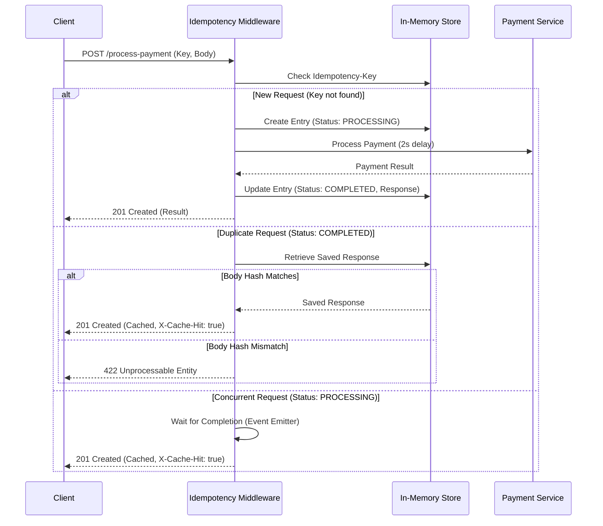

# Idempotency Gateway

A robust implementation of an **Idempotency Layer** for payment processing, ensuring that requests are processed exactly once regardless of network retries or duplicates.

## 1. Architecture Diagram

The following sequence diagram illustrates the flow of a request through the Idempotency Gateway:



## 2. Setup Instructions

### Prerequisites
- Node.js (v14+ recommended)
- npm

### Installation
1.  **Clone the repository** (or fork):
    ```bash
    git clone <repository-url>
    cd Idempotency-Gateway
    ```

2.  **Install dependencies**:
    ```bash
    npm install
    ```

### Running the Server
- **Start the server**:
    ```bash
    npm start
    ```
    The server will run on `http://localhost:8080`.

- **Development mode** (with nodemon):
    ```bash
    npm run dev
    ```

### verification
To verify the implementation, you can run the included verification script while the server is running:
```bash
node verify.js
```
This script runs 4 tests:
1.  **Happy Path**: Standard successful payment.
2.  **Duplicate Request**: Verifies idempotency (returns cached response).
3.  **Body Mismatch**: Ensures different payloads with the same key are rejected.
4.  **Concurrent Requests**: Ensures simultaneous requests with the same key are handled correctly (second request waits for first).

## 3. API Documentation

### `POST /process-payment`

Processes a payment. Requires an `Idempotency-Key` header.

#### Headers
| Header | Type | Required | Description |
| :--- | :--- | :--- | :--- |
| `Idempotency-Key` | `string` | Yes | A unique identifier for the request (e.g., UUID). |

#### Request Body
```json
{
  "amount": 100,
  "currency": "GHS"
}
```

#### Responses

**201 Created (Success)**
```json
{
  "success": true,
  "message": "Charged 100 GHS",
  "transactionId": "txn_1700000000000"
}
```

**201 Created (Idempotent Replay)**
Header: `X-Cache-Hit: true`
```json
{
  "success": true,
  "message": "Charged 100 GHS",
  "transactionId": "txn_1700000000000"
}
```

**422 Unprocessable Entity (Body Mismatch)**
```json
{
  "error": "Idempotency key already used for a different request body."
}
```

**400 Bad Request**
```json
{
  "error": "Idempotency-Key header is missing"
}
```

## 4. Design Decisions

### In-Memory Storage
For simplicity and speed, a Javascript `Map` is used as the key-value store. In a production environment, this should be replaced with a distributed store like **Redis** to support multiple server instances and persistence.

### Concurrency Handling
To handle the "Pre-Flight" or concurrent request scenario (Bonus User Story), the system uses an **Event Emitter**.
- If a request comes in with a key that is currently `PROCESSING`, the new request subscribes to a `completed` event for that key.
- Once the initial request finishes, it emits the event, and all waiting requests receive the saved response immediately.

### Body Hashing
To ensure data integrity, the request body is hashed (SHA-256) and stored with the key. If a subsequent request uses the same key but a different body hash, it is rejected to prevent fraud or errors.

## 5. Developer's Choice: Request Expiration (TTL)

### Feature: Automatic Record Expiration
To prevent memory bloat and ensure the system remains performant in production, idempotency records automatically expire after **1 hour**.

### How It Works
- When a payment request is processed, the timestamp is recorded.
- On subsequent requests with the same key, the system checks if the record is older than 1 hour.
- Expired records are automatically deleted from the store.
- After expiration, the same idempotency key can be reused for a new payment.

### Why This Matters for Production
1. **Memory Management**: Without TTL, the in-memory store would grow indefinitely, eventually causing memory issues.
2. **Realistic Use Case**: In practice, clients retry failed requests within seconds or minutes, not hours.
3. **Security**: Prevents indefinite key reservation that could be exploited.
4. **Scalability**: Keeps the store size bounded and predictable.

### Configuration
The TTL is set to 1 hour (3,600,000 milliseconds) and can be adjusted in `src/middleware/idempotency.middleware.js`.
